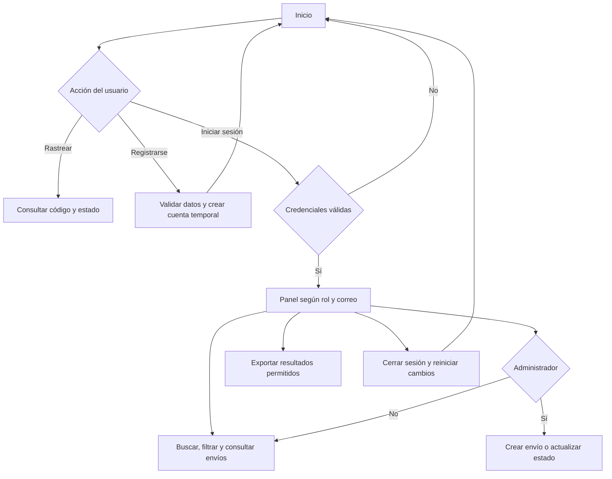

# Music Pro Courier · Django y JSON

Prototipo de **Transporte y Despachos** para la Evaluación 1 de Programación Backend. Permite consultar el recorrido de instrumentos musicales, gestionar órdenes temporales y mostrar información según el rol del usuario.

**Proyecto:** `bibliotecainacap` · **Aplicación:** `core` · **Python:** 3.12 o superior · **Django:** 6.1

[Ver diagrama de flujo en PDF](diagrama_music_pro.pdf)

## Ejecutar el proyecto

Descarga el repositorio con **Code → Download ZIP** y descomprímelo, o clónalo:

```powershell
git clone https://github.com/benjaminbenjabenjaben-cpu/BackEndd.git
cd BackEndd
```

Desde la carpeta que contiene `requirements.txt`, crea el entorno e instala las dependencias:

```powershell
python -m venv venv
.\venv\Scripts\python.exe -m pip install -r requirements.txt
.\venv\Scripts\python.exe bibliotecainacap\manage.py runserver 127.0.0.1:8000 --noreload
```

Abre **http://127.0.0.1:8000/** y mantén la terminal abierta. `Ctrl+C` detiene el servidor. Si `venv` ya existe y tiene las dependencias instaladas, basta con ejecutar el último comando.

No abras las plantillas HTML directamente: necesitan ser procesadas por Django. El entorno virtual se crea en cada computador; no se incluye en el repositorio.

**Esta entrega no usa base de datos ni requiere `migrate`.** Los datos iniciales se leen desde JSON. El backend de base de datos de Django está configurado como `dummy`.

## Accesos de demostración

| Rol | Correo | Contraseña |
|---|---|---|
| Administrador de operaciones | `admin@musicpro.test` | `MusicPro2026!` |
| Cliente | `cliente@musicpro.test` | `MusicPro2026!` |

Las credenciales son públicas y corresponden a cuentas ficticias para la evaluación.

Códigos de ejemplo: `MP-2026-001` (en camino), `MP-2026-002` (en bodega), `MP-2026-003` (enviado) y `MP-2026-004` (recibido).

## Funciones implementadas

- Registro de cliente temporal, inicio y cierre de sesión.
- Panel con indicadores calculados, búsqueda, filtros por estado y paginación.
- Creación de envíos con validación de correo, peso, bultos y campos obligatorios.
- Seguimiento secuencial: **En bodega → Enviado → En camino → Recibido**.
- Historial con nota y fecha para cada cambio de estado.
- Rastreo público con información limitada; el detalle requiere una cuenta autorizada.
- Exportación JSON de los resultados visibles y filtrados.
- Diseño adaptable a celulares, formularios con etiquetas y navegación por teclado.

El administrador ve ocho envíos iniciales. El cliente de ejemplo ve los cuatro asociados a su correo. Una cuenta recién creada comienza sin envíos.

## Organización del código

```text
bibliotecainacap/
  manage.py
  bibliotecainacap/
    settings.py             Configuración del proyecto
    urls.py                 Rutas principales
  core/
    urls.py                 Rutas semánticas de la aplicación
    views.py                Peticiones, permisos y contextos
    forms.py                Validaciones del servidor
    services.py             Lectura de JSON y filtros
    context_processors.py   Datos compartidos de la sesión
    data/envios.json         Despachos ficticios
    templates/core/         Plantillas DTL
    static/core/            Bootstrap, CSS, JavaScript e imagen local
    tests.py                Pruebas funcionales
requirements.txt
diagrama_music_pro.pdf
README.md
```

## Flujo general



El [PDF del diagrama](diagrama_music_pro.pdf) desarrolla las decisiones de acceso, registro, rastreo, privacidad y gestión de envíos.

## Verificación

```powershell
.\venv\Scripts\python.exe bibliotecainacap\manage.py check
.\venv\Scripts\python.exe bibliotecainacap\manage.py test core
```

**16 pruebas funcionales** comprueban permisos, privacidad, filtros, paginación, registro, exportación, creación, estados, cierre de sesión y CSRF. También verifican el peso mínimo exacto de 0,1 kg, los formularios POST vacíos y el cierre de la estimación al recibir un envío.

Las pruebas usan `SimpleTestCase`, que rechaza consultas a la base de datos.

## Alcance de la Evaluación 1

La pauta de U1 pide Django con JSON y sin conexión a base de datos. Las cuentas registradas duran hasta dos horas en caché. Las contraseñas de esas cuentas se guardan como hashes de Django. Los cambios de envíos pertenecen a la sesión y **no se comparten entre navegadores**. Salir, expirar la sesión o reiniciar el servidor reinicia esos cambios; el JSON de ejemplo permanece.

La web es una demostración local con `DEBUG=True`. No incluye GPS, notificaciones reales, cálculo de rutas, firmas digitales, base de datos, administrador persistente ni API DRF/JWT. Las ETAs son información de ejemplo. Las funciones posteriores deben ajustarse al alcance aprobado por el docente.

## Relación con la rúbrica

| Aspecto | Evidencia |
|---|---|
| Atributos y tipos | JSON de envíos, formularios y estructuras Python |
| Validaciones | `forms.py`, límites numéricos y reglas de estado |
| Condiciones y bucles | Permisos, filtros, contadores e historial |
| Plantillas dinámicas | `for`, `if`, `empty`, herencia y filtros DTL |
| Paquetes y módulos | Django, Bootstrap, formularios, mensajes y sesiones |
| Estructura del proyecto | Proyecto `bibliotecainacap`, aplicación `core` |
| Rutas y contextos | `urls.py`, nombres de ruta, `render` y diccionarios |
| Flujo e integración | Diagrama PDF, prueba en navegador y pruebas funcionales |

La evaluación incluye la presentación del estudiante y la validación del alcance por el docente. Este README no acredita esa aprobación ni garantiza una calificación.

## Referentes y apoyo de IA

Se revisaron [Onfleet](https://onfleet.com/route-planning) y [Route4Me](https://support.route4me.com/faq/how-to-collect-paperless-pod/) como referentes de seguimiento y comprobantes de entrega. Para este prototipo se adoptaron el código de seguimiento, la separación de estados y el historial; las funciones avanzadas quedan para un alcance posterior.

El diseño parte de las interfaces Stitch proporcionadas durante el desarrollo. [Bootstrap 5.3.8](https://getbootstrap.com/docs/5.3/getting-started/download/) se incluye localmente con su licencia MIT. La navegación no necesita descargar recursos externos.

Se utilizó IA como apoyo para adaptar las interfaces, corregir rutas, revisar validaciones y preparar pruebas. El estudiante debe comprender y explicar el código utilizado.
