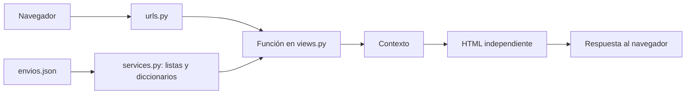

# Music Pro Courier · Prototipo U1

Portal académico de Transporte y Despachos, construido con Django, HTML semántico, Bootstrap y CSS propio. Conserva el diseño del portal y presenta ocho envíos ficticios leídos desde un archivo JSON.

La versión actual se ajusta a la corrección solicitada para la presentación: **sin modelos, Django Forms, base de datos, autenticación, sesiones ni plantillas heredadas o parciales**. Cada página contiene su documento HTML completo.

## Iniciar en este computador

Abre la terminal de Visual Studio Code en la carpeta del proyecto y ejecuta:

```powershell
.\venv\Scripts\python.exe bibliotecainacap\manage.py runserver 127.0.0.1:8000 --noreload
```

Abre **http://127.0.0.1:8000/**. Mantén abierta la terminal; `Ctrl+C` detiene el servidor. No hace falta activar el entorno porque el comando usa directamente su Python. Si modificas Python, detén y vuelve a iniciar el servidor.

Para instalar en otro equipo con Python 3.12 o superior:

```powershell
python -m venv venv
.\venv\Scripts\python.exe -m pip install -r requirements.txt
.\venv\Scripts\python.exe bibliotecainacap\manage.py runserver
```

No se necesita ejecutar migraciones ni crear un superusuario. Las plantillas se abren a través del servidor Django.

## Recorrido para la evaluación

1. Abre el inicio y presiona **Ingresar al portal**. Puedes dejar los campos vacíos: son visuales y no se validan credenciales.
2. En el panel muestra los cuatro contadores, la tabla, los filtros y la segunda página de resultados.
3. Busca `MP-2026-001` y explica sus etapas e historial. `MP-2026-004` es un ejemplo recibido.
4. Usa **Nuevo envío**, completa datos ficticios y muestra su vista previa.
5. Abre un envío en curso y usa **Actualizar estado** para ver cómo quedaría la siguiente etapa.
6. Vuelve al panel: los ocho ejemplos originales permanecen iguales. Ninguna de las dos acciones guarda cambios.
7. Exporta los resultados filtrados en JSON.

El registro también es visual: envía un formulario y muestra una confirmación, pero no crea cuentas. Las fechas, personas y direcciones son ficticias; no hay GPS ni integración con entregas reales.

## Cómo explicar el backend

> El navegador solicita una dirección. Django busca esa ruta en urls.py y ejecuta una función de views.py. La función obtiene los datos de ejemplo del JSON, prepara un diccionario llamado contexto y usa render para generar la página HTML. El navegador recibe el HTML terminado.



| Archivo o función | Qué explicar |
|---|---|
| `core/urls.py` | Relaciona direcciones como `/panel/` con funciones de las vistas. |
| `inicio` | GET muestra el acceso visual. POST redirige al panel sin comprobar correo ni contraseña. |
| `registro` | Muestra un formulario HTML y una confirmación de ejemplo al recibir POST. |
| `panel` | Lee los ocho envíos, aplica filtros, calcula contadores y pagina los resultados de seis en seis. |
| `rastreo` | Obtiene el código de GET, elimina espacios, convierte a mayúsculas y busca el envío. |
| `detalle_envio` | Busca un envío y devuelve su HTML; responde con estado 404 si no existe. |
| `mostrar_detalle` | Prepara las cuatro etapas del recorrido y el contexto del detalle. Es una función Python auxiliar. |
| `nuevo_envio` | Lee campos de POST, comprueba los datos de carga con Python y muestra una vista previa sin guardarla. |
| `actualizar_estado` | Prepara la siguiente etapa e historial para una vista previa sin modificar el JSON. |
| `exportar_envios` | Devuelve los ejemplos filtrados mediante `JsonResponse` como archivo descargable. |
| `ayuda` | Genera la página con instrucciones del portal. |
| `salir` | Conserva la ruta anterior: redirige al inicio; no hay una sesión que cerrar. |
| `services.cargar_envios` | Abre `data/envios.json` en modo lectura y lo convierte en una lista de diccionarios. |
| `services.preparar_envio` | Calcula etiquetas, porcentaje y fechas para la presentación. |
| `services.filtrar_envios` | Selecciona elementos de la lista según texto y estado. |

**GET** se usa para consultar y filtrar. **POST** recibe los campos enviados desde un formulario. `render` devuelve HTML y `redirect` lleva al navegador a otra dirección.

Los formularios usan etiquetas `<form>`, `<label>`, `<input>`, `<select>` y `<textarea>` escritas directamente en cada HTML. No existe `forms.py`, ni clases `forms.Form`, ni `ModelForm`. Las comprobaciones simples de bultos y peso evitan errores de conversión; el acceso no valida usuarios. `` protege el envío de formularios y no es una validación de inicio de sesión.

Las plantillas tienen `header`, `nav`, `main`, `section` y `footer`. Usan variables `{{ ... }}`, condiciones `` y ciclos `` para mostrar el contexto. No usan `extends`, `include` ni `block`. Los CSS y JavaScript siguen siendo archivos estáticos comunes.

El `include` de `bibliotecainacap/urls.py` solamente conecta las rutas de la aplicación: no incluye fragmentos HTML ni implementa herencia de plantillas.

**Framework CSS de esta versión:** Bootstrap local, junto a `portal.css`. La versión actual no carga Tailwind. Se conserva este diseño en la corrección.

## Archivos principales

```text
bibliotecainacap/
  manage.py
  bibliotecainacap/
    settings.py
    urls.py
  core/
    urls.py
    views.py
    services.py
    tests.py
    data/envios.json
    templates/core/
      iniciar_sesion.html
      registro_usuario.html
      panel_envios.html
      buscar_envio.html
      detalle_envio.html
      nuevo_envio.html
      actualizar_estado.html
      ayuda.html
      error.html
    static/core/
      portal.css
      portal.js
      concierto.jpg
      favicon.svg
      vendor/
```

## Verificación y avances

```powershell
.\venv\Scripts\python.exe bibliotecainacap\manage.py check
.\venv\Scripts\python.exe bibliotecainacap\manage.py test core
```

Las 14 pruebas comprueban navegación sin cuentas, acceso visual, filtros, paginación, rastreo, detalle, vistas previas sin modificar el JSON, exportación, escape del texto y protección CSRF. Usan `SimpleTestCase`, que impide consultas a una base de datos.

Para mostrar avances al profesor, abre el historial **Commits** de [este repositorio](https://github.com/benjaminbenjabenjaben-cpu/BackEndd). El historial conserva la implementación inicial y registra la simplificación y actualización de esta guía como cambios posteriores reales. Cada nuevo avance debe registrarse después de realizarlo y comprobarlo; no se alteran fechas ni se reconstruye un historial ficticio.
